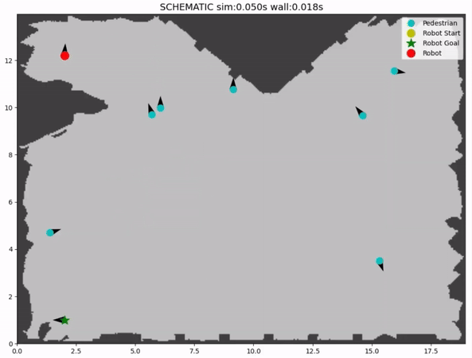

# BRNE: Bayesian Recursive Nash Equilibrium for Social Navigation




This repository contains relevant code for BRNE (Bayesian Recursive Nash Equilibrum), an algorithm that computes mixed strategy Nash equilibrium for real-time human-aware navigation in dense crowds. It contains PyTorch-based tutorial, a fully ROS integrated social navigation framework powered by BRNE, implemented in both PyTorch and C++, as well as implementations for simulated benchmark studies. 

Video demonstrations of the algorithm deployed on an Unitree Go1 quadruped can be found at the [project website](https://sites.google.com/view/brne-crowdnav) and Katie's [portfolio post](https://katie-hughes.github.io/crowdnav/). You can also find more details on the project from our invited presentation at [NVIDIA GTC 2024](https://www.nvidia.com/en-us/on-demand/session/gtc24-se63278/).


Details of the algorithm can be found in our [IJRR paper](https://journals.sagepub.com/doi/10.1177/02783649241302342). To cite this work:

```
@article{doi:10.1177/02783649241302342,
author = {Max Muchen Sun and Francesca Baldini and Katie Hughes and Peter Trautman and Todd Murphey},
title ={Mixed strategy Nash equilibrium for crowd navigation},
journal = {The International Journal of Robotics Research},
year = {2024},
doi = {10.1177/02783649241302342},
URL = {https://doi.org/10.1177/02783649241302342},
eprint = {https://doi.org/10.1177/02783649241302342}}
```

The structure of the repo is as follow: 

- [`tutorials`](tutorials) contains Python tutorials to illustrate the principle of the BRNE algorithm and intuitive PyTorch implementation for simple hallway navigation scenarios.
- [`brne_nav`](brne_nav) contains the fully integrated ROS social navigation framework. If you are interested in deploying BRNE, you should copy this directory as a ROS package.
- [`socnavbench`](socnavbench) contains the implementation and installation instructions for the [SocNavBench](https://github.com/CMU-TBD/SocNavBench) benchmark study.


*Contact: Please contact Max* ([*msun@u.northwestern.edu*](mailto:msun@u.northwestern.edu)) *if you have any question*.
